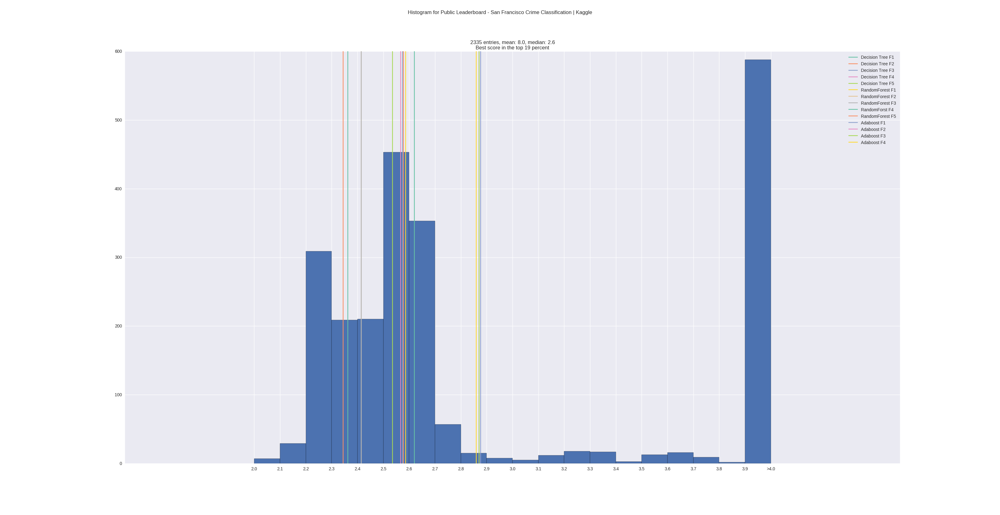

# kaggleLeaderboardStats

This script pulls the scores of a kaggle leaderboard website, shows a histogram of the scores and visualizes where your score would be located, and calculates the top percentage your score would be in.

